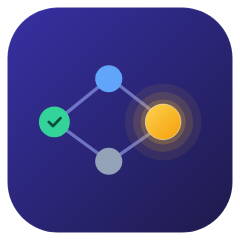

<div align="center">



# tutask

**See your tasks' breakdown and timeline at a glance.**

A single-file, local-first task planner that turns a goal into a dependency graph — visual for humans, structured for AI.

English · [中文](README.zh-CN.md)


</div>

---

## Why tutask

- **🕸️ A dependency graph, not a flat list** — see what blocks what, where the critical path runs, and which tasks you can start right now. Nodes whose prerequisites are all done get a **golden glow**.
- **📅 Two views, one dataset** — flip between the graph and a **timeline** laid out by deadline (day / week / month scales). Overdue tasks turn red.
- **🤖 A clean data contract for AI** — every goal is a schema-validated `goals/<id>.json` file. Agents and scripts can read/write tasks directly, no UI clicking. Humans read the graph, AI edits the data.
- **📦 Truly local-first** — builds to one zero-dependency `dist/index.html`. No backend, no account, no network. Your data stays with you.
- **⌨️ Keyboard-driven** — `Tab` for a successor, `Enter` for a parallel task. Graphing as fast as outlining.

## Quick start

```bash
npm install
npm run build      # produces dist/index.html — just double-click it
```

Dev mode:

```bash
npm run watch      # watch and rebuild
npx serve src      # run ESM source directly, no build
npm test           # unit tests (Vitest)
npm run test:e2e   # end-to-end tests (Playwright)
```

## Timeline view

<div align="center">


*The same data spread along a time axis by deadline — overdue tasks in red.*

</div>

## Core concepts

The whole thing is a **DAG (directed acyclic graph)**:

- **Nodes** are shown by depth as Goal (root) → Project (directly under the goal) → Task (deeper levels).
- **Edges are dependencies**, with a fixed direction: `child / prerequisite → parent / the node it realizes`. Arrows point child → parent, and children sit to the right of their parent.
- Any edge that would create a cycle is **rejected and flashes red**, so the graph always stays topologically executable.

### Visual semantics

| Appearance | Meaning |
|---|---|
| Gray / Blue / Green | Todo / In progress / Done |
| **Golden glow** | All prerequisites done — **ready to start** |
| Red date badge | Past deadline and not done |

## Controls

### Keyboard

| Key | Action |
|---|---|
| `Tab` | Create a successor task after the selected node (auto-links the dependency) |
| `Enter` | Create a parallel task (inherits all prerequisites of the selected node) |
| Double-click / `F2` | Edit node title |
| `Space` | Cycle status: Todo → In progress → Done |
| `D` | Toggle the detail panel (description, status, hours, deadline, prerequisites) |
| `Delete` | Delete the node (successors are kept, only dependencies are detached) |
| Arrow keys | Move the selection along edges / within the same level |
| `Esc` | Cancel selection / cancel editing |

### Mouse

- Drag a node within the tree to reorder it among siblings; a free node created by double-clicking empty space keeps its manual position, returning to auto-layout once wired into the graph.
- Drag from the dot on a node's right edge to create a dependency (cycles are rejected and flash red).
- Right-click an edge to delete the dependency; drag empty space to pan, scroll to zoom.
- The `▾` at a node's top-right collapses its prerequisite subtree (`N▸` shows the collapsed count — click to expand).

## Multiple goals & data storage

- The dropdown on the left of the toolbar switches between goals (canvases); `＋` creates, `🗑` deletes, the title input renames. "Import JSON" adds data as a **new goal** without overwriting existing data.
- Data lives in the browser's **localStorage** by default, scoped to "browser + page origin" — `localhost` and `file://` are two independent copies.
- **Bind a data directory** (Chrome / Edge): read/write goals to a local `goals/` directory, one `<id>.json` per goal. Bind both the `localhost` and the double-clicked page to the **same directory** to share data; switching back to the tab auto-reloads changes. The bound state shows in the toolbar (click to unbind); after a browser restart, click "Reconnect" once to restore it.

## Documentation

- [Features](docs/features.md) — full feature and interaction details
- [Architecture](docs/architecture.md) — module breakdown and design trade-offs

## Tech stack

Pure front-end, zero runtime dependencies. Built with [esbuild](https://esbuild.github.io/), tested with [Vitest](https://vitest.dev/) and [Playwright](https://playwright.dev/).
