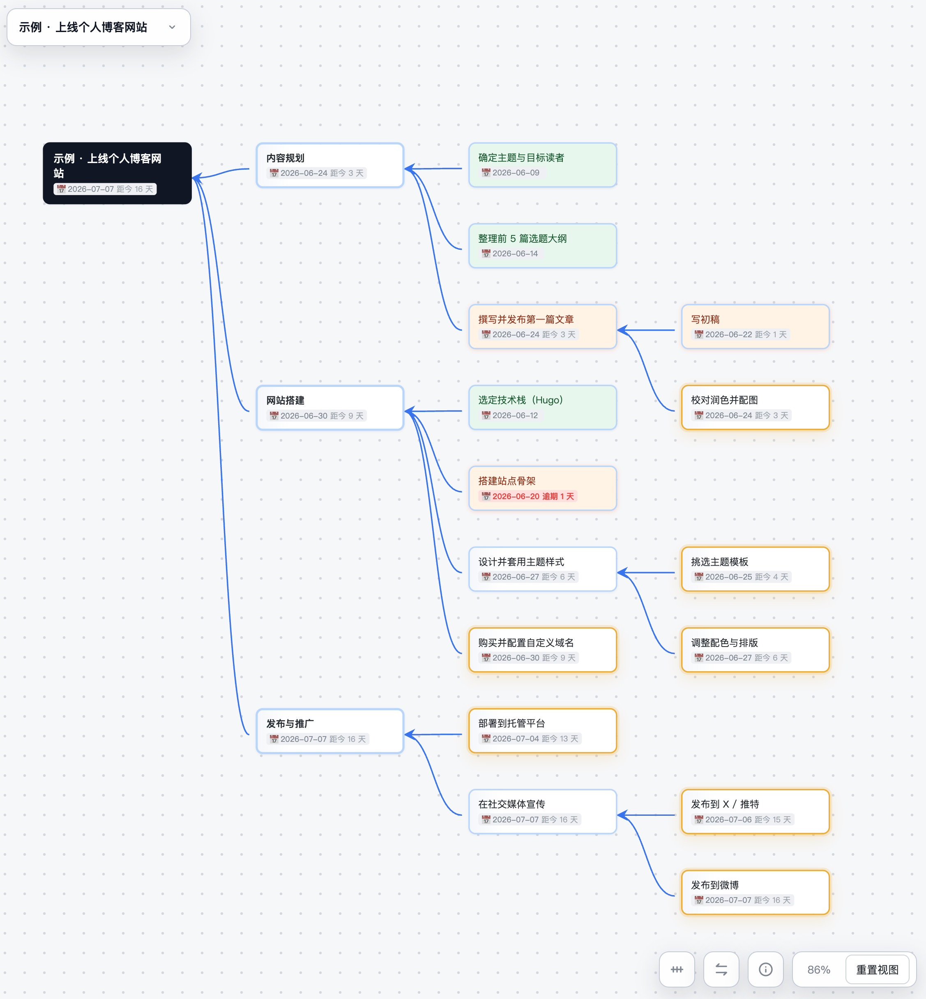
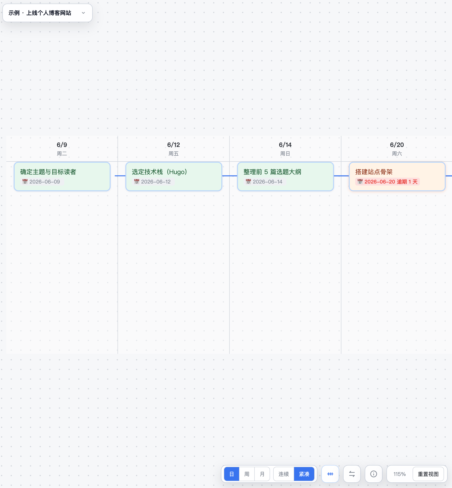

<div align="center">

# tutask

**一张图，看清任务的拆解和时间进度。**

单文件、本地优先的任务规划工具——把目标拆成依赖关系图，给人看，也给 AI 用。

[English](README.md) · 中文



</div>

---

## 为什么用 tutask

- **🕸️ 是依赖图，不是扁平列表** —— 谁挡着谁、关键路径在哪、现在能动手的是哪几个，一眼看清。所有前序已完成的节点会**金色发光**。
- **📅 两种视图，同一份数据** —— 在依赖图和按截止日期排布的**时间线**之间切换（日 / 周 / 月刻度），逾期任务标红。
- **🤖 给 AI 的清晰数据契约** —— 每个 Goal 都是一份带 schema 校验的 `goals/<id>.json` 文件。Agent 和脚本可直接读写任务，无需点界面。人看图，AI 改数据。
- **📦 真·本地优先** —— 构建成一个零依赖的 `dist/index.html`。无后端、无账号、无网络，数据在你手里。
- **⌨️ 键盘流** —— `Tab` 接后继、`Enter` 开并行，画图快过大纲笔记。

## 快速开始

```bash
npm install
npm run build      # 产出 dist/index.html，双击即用
```

开发模式：

```bash
npm run watch      # 监听并重建
npx serve src      # ESM 源码直跑，免构建
npm test           # 单元测试 (Vitest)
npm run test:e2e   # 端到端测试 (Playwright)
```

## 时间线视图

<div align="center">



*同一份数据按截止日期沿时间轴铺开 —— 逾期任务标红。*

</div>

## 核心概念

整张图是一个 **DAG（有向无环图）**：

- **节点**按所在层级显示为 Goal（根）→ Project（直连 Goal）→ Task（更深层）。
- **连线表示依赖**，方向固定为 `子节点/前序步骤 → 父节点/被实现的节点`；箭头由子指向父，子节点排在父节点右侧。
- 形成环的连线会被**拒绝并闪红**，保证图始终可拓扑执行。

### 视觉语义

| 表现 | 含义 |
|---|---|
| 灰 / 蓝 / 绿 | 待开始 / 进行中 / 已完成 |
| **金色发光** | 所有前序已完成，**可以开始** |
| 红色日期角标 | 截止日期已过且未完成 |

## 操作

### 键盘

| 键 | 行为 |
|---|---|
| `Tab` | 在选中节点后创建后继任务（自动连依赖线） |
| `Enter` | 创建并行任务（继承选中节点的所有前序） |
| 双击 / `F2` | 编辑节点标题 |
| `Space` | 切换状态：待开始 → 进行中 → 已完成 |
| `D` | 展开/收起详情面板（描述、状态、工时、截止日期、前序列表） |
| `Delete` | 删除节点（后续任务保留，仅断开依赖） |
| 方向键 | 沿依赖线 / 同层移动选中 |
| `Esc` | 取消选中 / 取消编辑 |

### 鼠标

- 拖动树内节点调整同父节点下的上下顺序；双击空白创建的游离任务保留手动位置，连入图后回到自动排布。
- 从节点右侧圆点拖出连线建立依赖（循环依赖会被拒绝并闪红）。
- 右键点连线删除依赖；空白处拖拽平移，滚轮缩放。
- 节点右上 `▾` 收起其前序子树（`N▸` 显示折叠数量，再点展开）。

## 多 Goal 与数据存储

- 工具栏左侧下拉可在多个 Goal（画布）间切换，`＋` 新建、`🗑` 删除，标题输入框直接改名。「导入 JSON」会作为**新 Goal** 加入，不覆盖现有数据。
- 默认存浏览器 **localStorage**，数据跟随"浏览器 + 页面来源"——`localhost` 和 `file://` 打开是两份独立数据。
- **绑定数据目录**（Chrome / Edge）：把 Goal 读写到本地 `goals/` 目录，每个 Goal 一个 `<id>.json` 文件。让 `localhost` 与双击打开的页面绑定**同一个目录**即可共用数据；切回标签页时自动重载新改动。绑定状态显示在工具栏（点击可解除），浏览器重启后点一次「重新连接」即可恢复。

## 文档

- [功能说明](docs/features.md) —— 完整功能与交互细节
- [技术架构](docs/architecture.md) —— 模块划分与设计取舍

## 技术栈

纯前端，零运行时依赖。构建用 [esbuild](https://esbuild.github.io/)，测试用 [Vitest](https://vitest.dev/) 和 [Playwright](https://playwright.dev/)。
